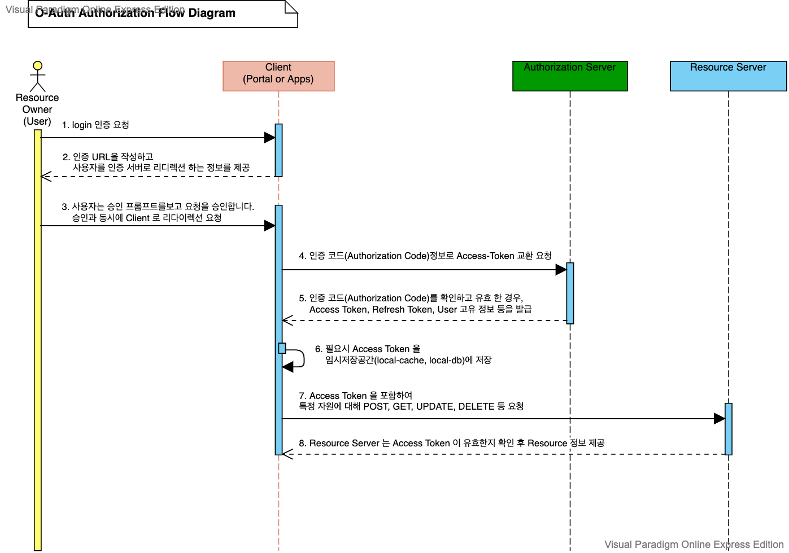

# O-Auth 
O-Auth 는 외부서비스의 인증 및 권한부여를 관리하는 범용적인 프로토콜입니다.

[O-Auth 참고](https://www.oauth.com/)


## O-Auth 주요 컴포넌트 

### Resource Owner
User, 즉 일반 사용자를 칭합니다. 
 
### Client
일반 사용자가 사용하는 애플리케이션

### Authorization Server
사용자가 앱을 통해 요청한 인증을 처리 하고 Access Token 을 발급 하거나, 
Token 만료 시점에 Refresh Token 을 재발급 해주는 역할을 합니다.

### Resource Server
RESTFul 을 예로 하자면, Client 가 헤더에 Access Token 을 포함하여 특정 자원에 대해 POST, GET, UPDATE, DELETE 요청을 하면 Resource Server 는 관련 처리를 제공 합니다.
 

## O-Auth 인증 프로세스




O-Auth 프로세스 흐름 개요

1. Resource Owner(사용자)가 Client(모바일 앱, 포탈 사이트)에게 인증 요청을 합니다.

2. Client 는 인증 코드를 요청 합니다.  
   인증 URL을 작성하고 사용자를 인증 서버로 리디렉션 하는 정보를 제공
```text
https://authorization-server.com/authorize?
  response_type=code
  &client_id=5PgOYlFtb5l5VeKvkmo6dlmT
  &redirect_uri=https://www.oauth.com/playground/authorization-code.html
  &scope=photo+offline_access
  &state=kooudGFeyb6RPGiW
```

3. Resource Owner는 승인 프롬프트를보고 요청을 승인합니다. 
Client 는 승인과 동시에 Client 는 state 상태가 일치 하는지 확인후 리다이렉션 요청이 됩니다. 
````text
?state=Isi-ZqmtE5itAQgF&code=eBUPCWC8WJTgppx6UM0jzJb-MqRCna66iWVlu8CJKOruAwhH
````

4. Client 는 인증 코드(Authorization Code)정보로 Authorization Server 에게  Access-Token 교환 요청을 합니다. 

[Client 정보와 함께 OAuth 서버에 Access-Token 교환 요청 예시]
```text
POST https://authorization-server.com/token

grant_type=authorization_code
&client_id=5PgOYlFtb5l5VeKvkmo6dlmT
&client_secret=HFKH9o_YdAJgg6wnZpradz5WY1rWhyjrO8N12rkkbi0Vd7UW
&redirect_uri=https://www.oauth.com/playground/authorization-code.html
&code=pD7j1vIxAOCERfxQfm11jl3E89QIUZc06V6L1h5mmRVPfOJ3
```

5. Authorization Server 는 권한 증서(Authorization Grant)를 확인하고 유효 한 경우, Access Token, Refresh Token, User Profile 정보(사용자 고유 정보) 등을 발급하여 Client 에 내려줍니다. 

[Authorization Server의 응답 예시]
```json
{
  "token_type": "Bearer",
  "expires_in": 86400,
  "access_token": "RclJzZtToHtgWZIGRtx-djwoG4t5xdhVBqKVXkqzL9X-Ln4TlAxf2zV5EK4mn89z6aRcXQ3M",
  "scope": "photo offline_access",
  "refresh_token": "U6ASo-h7x0m528CF2-cN68qA"
}
```
6. Client 는 해당 Access Token 을 임시저장공간(local-cache, local-db)에 저장하거나 Resource Owner 에게 넘깁니다.

7. Client 는 Access Token 을 첨부하여 Resource Server 에 Resource 액세스를 위한 요청을 합니다.
```text
POST /market/orders HTTP/1.1  
Authorization: OAuth oauth_consumer_key="h7x0m528CF2",access_token="Ln4TlAxf2zV5E"  
,oauth_signature_method="HMACSHA1",oauth_timestamp="1379133202",oauth_nonce="chapoH",oauth_signature="MdpQcU8iPSUjWoN%2FUDMsK2sui9I%3D"
Accept-Encoding: gzip, deflate  
Connection: Keep-Alive  
Host: https://market.myshop.com 
```
8. Resource Server 는 Access Token 이 유효한지 확인 후, Client 에게 자원을 보냅니다.
